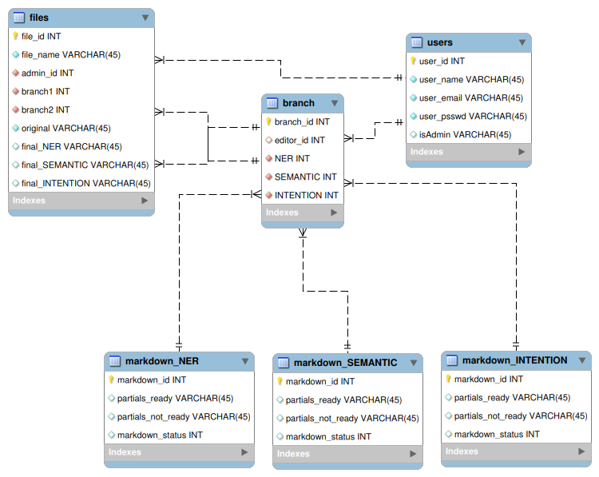

# Реалізація інформаційного та програмного забезпечення

В рамках проекту розробляється: 
## SQL-скрипт для створення на початкового наповнення бази даних:

```sql
-- MySQL Workbench Forward Engineering

SET @OLD_UNIQUE_CHECKS=@@UNIQUE_CHECKS, UNIQUE_CHECKS=0;
SET @OLD_FOREIGN_KEY_CHECKS=@@FOREIGN_KEY_CHECKS, FOREIGN_KEY_CHECKS=0;
SET @OLD_SQL_MODE=@@SQL_MODE, SQL_MODE='ONLY_FULL_GROUP_BY,STRICT_TRANS_TABLES,NO_ZERO_IN_DATE,NO_ZERO_DATE,ERROR_FOR_DIVISION_BY_ZERO,NO_ENGINE_SUBSTITUTION';

-- -----------------------------------------------------
-- Schema mydb
-- -----------------------------------------------------

-- -----------------------------------------------------
-- Schema mydb
-- -----------------------------------------------------
CREATE SCHEMA IF NOT EXISTS `mydb` DEFAULT CHARACTER SET utf8 ;
USE `mydb` ;

-- -----------------------------------------------------
-- Table `mydb`.`users`
-- -----------------------------------------------------
CREATE TABLE IF NOT EXISTS `mydb`.`users` (
  `user_id` INT NOT NULL,
  `user_name` VARCHAR(45) NOT NULL,
  `user_email` VARCHAR(45) NOT NULL,
  `user_psswd` VARCHAR(45) NOT NULL,
  `isAdmin` VARCHAR(45) NULL,
  PRIMARY KEY (`user_id`),
  UNIQUE INDEX `user_id_UNIQUE` (`user_id` ASC) VISIBLE,
  UNIQUE INDEX `user_email_UNIQUE` (`user_email` ASC) VISIBLE)
ENGINE = InnoDB;


-- -----------------------------------------------------
-- Table `mydb`.`markdown_NER`
-- -----------------------------------------------------
CREATE TABLE IF NOT EXISTS `mydb`.`markdown_NER` (
  `markdown_id` INT NOT NULL,
  `partials_ready` VARCHAR(45) NULL,
  `partials_not_ready` VARCHAR(45) NULL,
  `markdown_status` INT NULL,
  PRIMARY KEY (`markdown_id`),
  UNIQUE INDEX `markdown_id_UNIQUE` (`markdown_id` ASC) VISIBLE)
ENGINE = InnoDB;


-- -----------------------------------------------------
-- Table `mydb`.`markdown_SEMANTIC`
-- -----------------------------------------------------
CREATE TABLE IF NOT EXISTS `mydb`.`markdown_SEMANTIC` (
  `markdown_id` INT NOT NULL,
  `partials_ready` VARCHAR(45) NULL,
  `partials_not_ready` VARCHAR(45) NULL,
  `markdown_status` INT NULL,
  PRIMARY KEY (`markdown_id`),
  UNIQUE INDEX `markdown_id_UNIQUE` (`markdown_id` ASC) VISIBLE)
ENGINE = InnoDB;


-- -----------------------------------------------------
-- Table `mydb`.`markdown_INTENTION`
-- -----------------------------------------------------
CREATE TABLE IF NOT EXISTS `mydb`.`markdown_INTENTION` (
  `markdown_id` INT NOT NULL,
  `partials_ready` VARCHAR(45) NULL,
  `partials_not_ready` VARCHAR(45) NULL,
  `markdown_status` INT NULL,
  PRIMARY KEY (`markdown_id`),
  UNIQUE INDEX `markdown_id_UNIQUE` (`markdown_id` ASC) VISIBLE)
ENGINE = InnoDB;


-- -----------------------------------------------------
-- Table `mydb`.`branch`
-- -----------------------------------------------------
CREATE TABLE IF NOT EXISTS `mydb`.`branch` (
  `branch_id` INT NOT NULL,
  `editor_id` INT NULL,
  `NER` INT NOT NULL,
  `SEMANTIC` INT NOT NULL,
  `INTENTION` INT NOT NULL,
  PRIMARY KEY (`branch_id`),
  INDEX `editor_idx` (`editor_id` ASC) VISIBLE,
  INDEX `NER_idx` (`NER` ASC) VISIBLE,
  INDEX `SEMANTIC_idx` (`SEMANTIC` ASC) VISIBLE,
  INDEX `INTENTION_idx` (`INTENTION` ASC) VISIBLE,
  CONSTRAINT `editor`
    FOREIGN KEY (`editor_id`)
    REFERENCES `mydb`.`users` (`user_id`)
    ON DELETE NO ACTION
    ON UPDATE NO ACTION,
  CONSTRAINT `NER`
    FOREIGN KEY (`NER`)
    REFERENCES `mydb`.`markdown_NER` (`markdown_id`)
    ON DELETE NO ACTION
    ON UPDATE NO ACTION,
  CONSTRAINT `SEMANTIC`
    FOREIGN KEY (`SEMANTIC`)
    REFERENCES `mydb`.`markdown_SEMANTIC` (`markdown_id`)
    ON DELETE NO ACTION
    ON UPDATE NO ACTION,
  CONSTRAINT `INTENTION`
    FOREIGN KEY (`INTENTION`)
    REFERENCES `mydb`.`markdown_INTENTION` (`markdown_id`)
    ON DELETE NO ACTION
    ON UPDATE NO ACTION)
ENGINE = InnoDB;


-- -----------------------------------------------------
-- Table `mydb`.`files`
-- -----------------------------------------------------
CREATE TABLE IF NOT EXISTS `mydb`.`files` (
  `file_id` INT NOT NULL,
  `file_name` VARCHAR(45) NOT NULL,
  `admin_id` INT NOT NULL,
  `branch1` INT NOT NULL,
  `branch2` INT NOT NULL,
  `original` VARCHAR(45) NOT NULL,
  `final_NER` VARCHAR(45) NULL,
  `final_SEMANTIC` VARCHAR(45) NULL,
  `final_INTENTION` VARCHAR(45) NULL,
  PRIMARY KEY (`file_id`),
  UNIQUE INDEX `file_id_UNIQUE` (`file_id` ASC) VISIBLE,
  INDEX `user_id_idx` (`admin_id` ASC) VISIBLE,
  INDEX `branch1_idx` (`branch1` ASC) VISIBLE,
  INDEX `branch2_idx` (`branch2` ASC) VISIBLE,
  CONSTRAINT `user_id`
    FOREIGN KEY (`admin_id`)
    REFERENCES `mydb`.`users` (`user_id`)
    ON DELETE NO ACTION
    ON UPDATE NO ACTION,
  CONSTRAINT `branch1`
    FOREIGN KEY (`branch1`)
    REFERENCES `mydb`.`branch` (`branch_id`)
    ON DELETE NO ACTION
    ON UPDATE NO ACTION,
  CONSTRAINT `branch2`
    FOREIGN KEY (`branch2`)
    REFERENCES `mydb`.`branch` (`branch_id`)
    ON DELETE NO ACTION
    ON UPDATE NO ACTION)
ENGINE = InnoDB;


SET SQL_MODE=@OLD_SQL_MODE;
SET FOREIGN_KEY_CHECKS=@OLD_FOREIGN_KEY_CHECKS;
SET UNIQUE_CHECKS=@OLD_UNIQUE_CHECKS;
```

## EER модель
<p align="center">
  
</p>


## RESTfull сервіс для управління даними
 
### Підключення до бази даних
```js
  const mysql = require('mysql2');

  module.exports = mysql.createConnection({
    host: 'localhost',
    user: 'oleh',
    password: 'password',
    database: 'mydb'
  })  
```
  
### express.js-сервер

```js
  const express = require('express');
  const db = require('./database');
  const bodyParser = require('body-parser');
  
  const app = express();
  const port = 5000;
  
  app.use(bodyParser.json());
  
  app.get('/', (req, res) => {
    db.query('SELECT * FROM files;', (err, files) => {
      if (err) {
        console.log(err);
        res.status(500).send(err);
        return;
      }
  
      if(files.length == 0) {
        res.status(201).json({
          message: "Table is empty"
        });
      }
  
      res.status(201).json({ data: files });
    })
  });
  
  app.get('/:id', (req, res) => {
    const {id} = req.params;
    console.log(id);
    db.query(`SELECT * FROM files WHERE file_id = ${id}`, (err, file) => {
      if (err) {
        console.log(err);
        res.status(500).send(err);
        return;
      }
  
      if (file.length == 0) {
        console.log('There is no file with such id');
        res.status(404).json({
          message: 'There is no file with such id'
        })
        return;
      }
      console.log(file);
      res.status(201).json({ data: file });
    });
  })
  
  app.post('/', (req, res) => {
    const {
      file_id,
      file_name,
      admin_id,
      branch1,
      branch2,
      original,
      final_NER,
      final_SEMANTIC,
      final_INTENTION
    } = req.body;
    if (
      file_id &&
      file_name &&
      admin_id &&
      branch1 &&
      branch2 &&
      original &&
      final_NER &&
      final_SEMANTIC &&
      final_INTENTION
    ) {
       db.query(`INSERT INTO files(file_id, file_name, admin_id, branch1, branch2, original, final_NER, final_SEMANTIC, final_INTENTION) VALUES("${file_id}", "${file_name}", "${admin_id}", "${branch1}", "${branch2}", "${original}", "${final_NER}", "${final_SEMANTIC}", "${final_INTENTION}")`, (err) => {
        console.log(err);
        res.status(500).json({
          error: err
        })
        return;
      });
  
      res.status(201).send({msg: 'Created User' });
    } else {
      console.log('Wrong data provided');
      res.json({
        error: 'Wrong data provided'
      });
    }
  })
  
  app.put('/:id', (req, res) => {
    const {id} = req.params;
    db.query(`SELECT * FROM files WHERE file_id = ${id}`, (err, [file]) => {
      if (err) {
        console.log(err);
        res.status(500).json({
          error: err
        })
        return;
      }
      
      if (!file) {
        res.status(500).json({ message: 'There is no such file'})
        console.log('There is no file with such id');
        return;
      }
  
      let query = "UPDATE files SET ";
  
      for (key of Object.keys(file)) {
        if (req.body[key]) {
          query += `${key} = '${req.body[key]}'`;
        }
      }
      query += `WHERE file_id = ${id}`;
      db.query(query, (err) => {
        if (err) {
          console.log(err);
          return;
        }
  
        res.status(201).send(`Changed lines ${Object.keys(req.body)} in file ${id}`);
      })
    }); 
  })
  
  app.delete('/:id', (req, res) => {
    const {id} = req.params;
  
    db.query(`SELECT * FROM files WHERE file_id = ${id}`, (err, file) => {
      if (err) {
        console.log(err);
        res.status(500).json({
          error: err
        })
        return;
      }
      if (file.length == 0) {
        res.status(404).json({ error: "There is no such user" });
        return;
      }

     db.query(`DELETE FROM files WHERE file_id = ${id}`, (err) => {
       if (err) {
          console.log(err);
          res.status(404).json({ error: err });
          return;
        }
        res.status(201).json({ message: `User ${id} deleted` });
      })
    })
  })
  
  app.listen(port, () => {
    console.log(`Server now listening on port ${port}`);
  })
```
