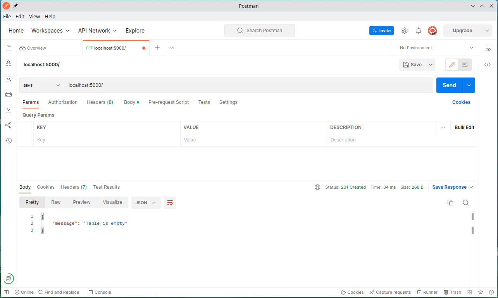
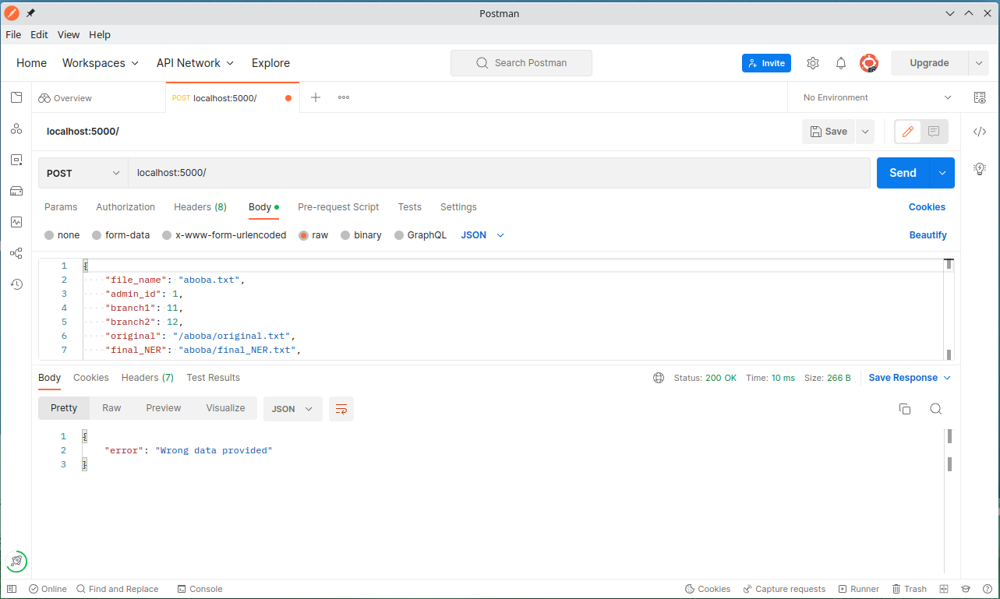
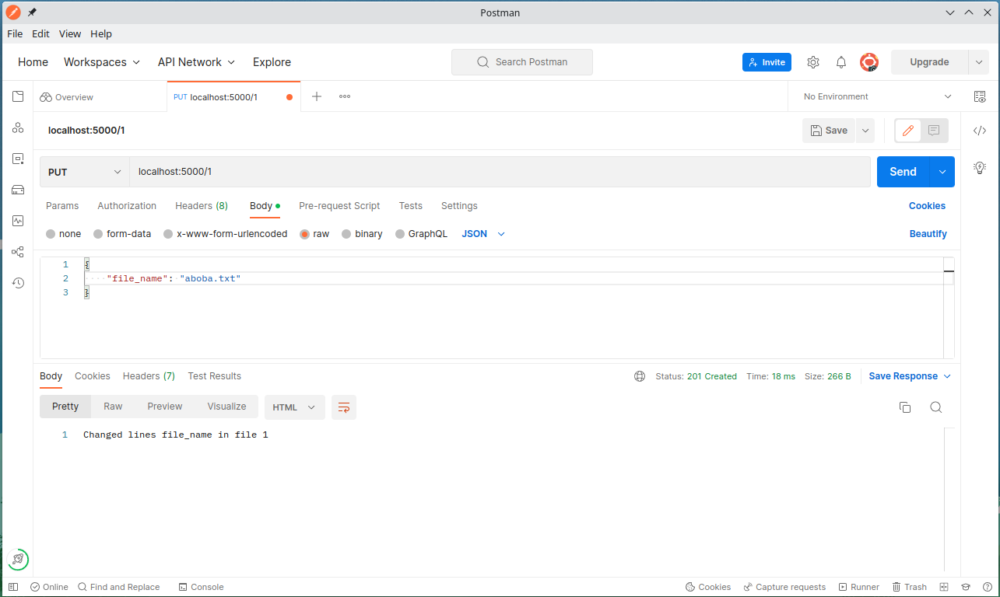
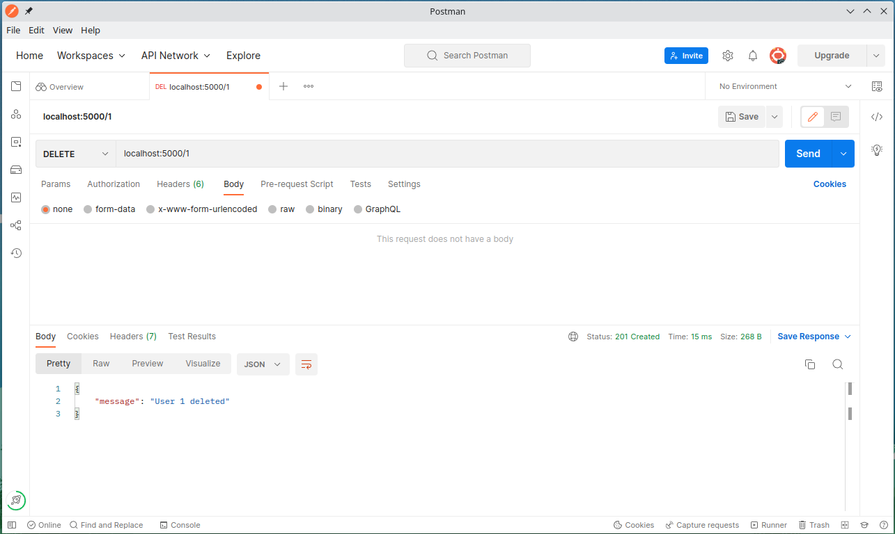

# Тестування працездатності системи

Використовувався Postman 

## Відображення всіх сутностей (GET запит)

  

## Додавання сутності (POST запит)

  

## Спроба додавання сутності з email, що вже існує

  

## Cпроба додати сутність не передавши всі необхідні дані

  

## Отримання певної сутності по id (GET запит)

  

## Оновлення певної сутності по id (PUT запит)

  

## Спроба оновлення певної сутності по id якого не існує 

  

## Видалення певної сутності по id (DELETE запит)

  

